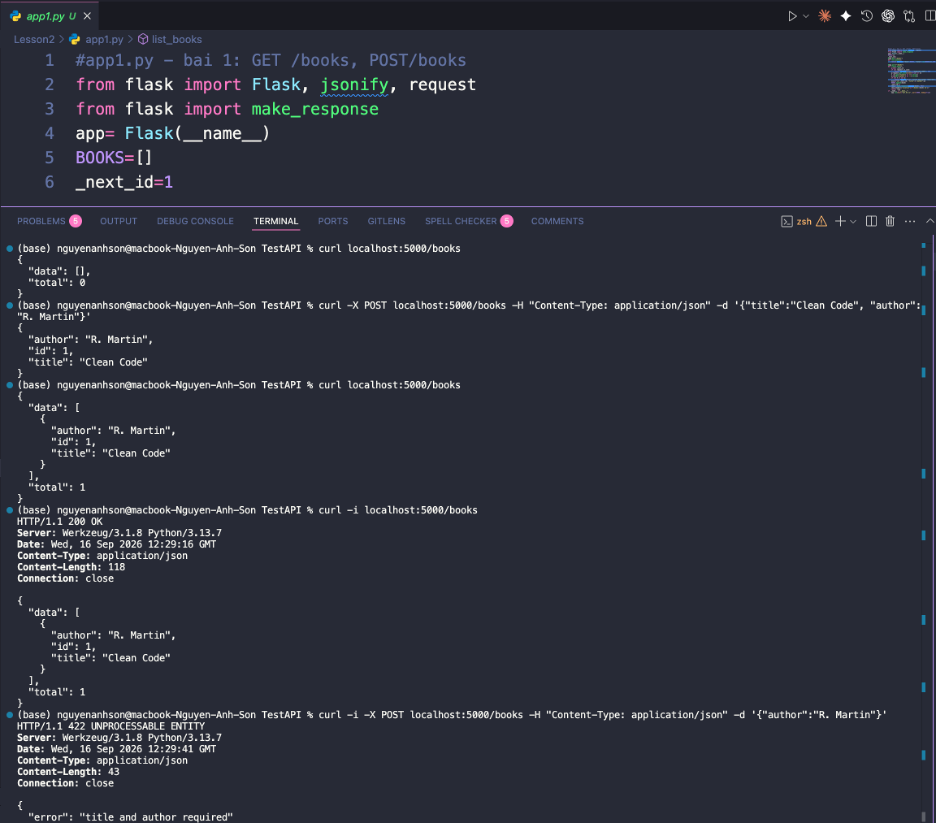
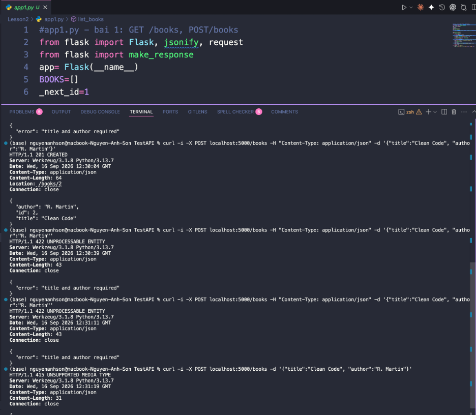
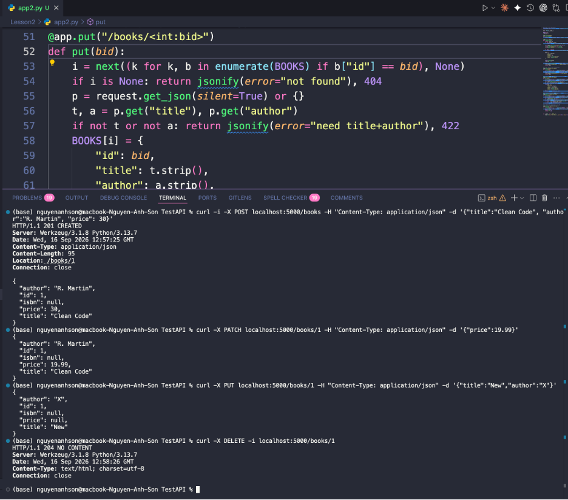
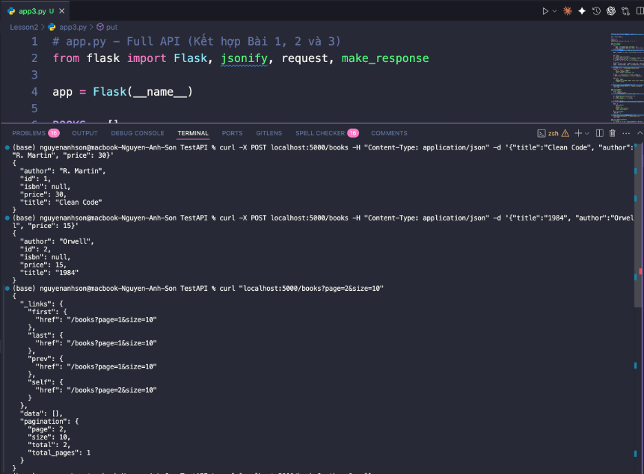
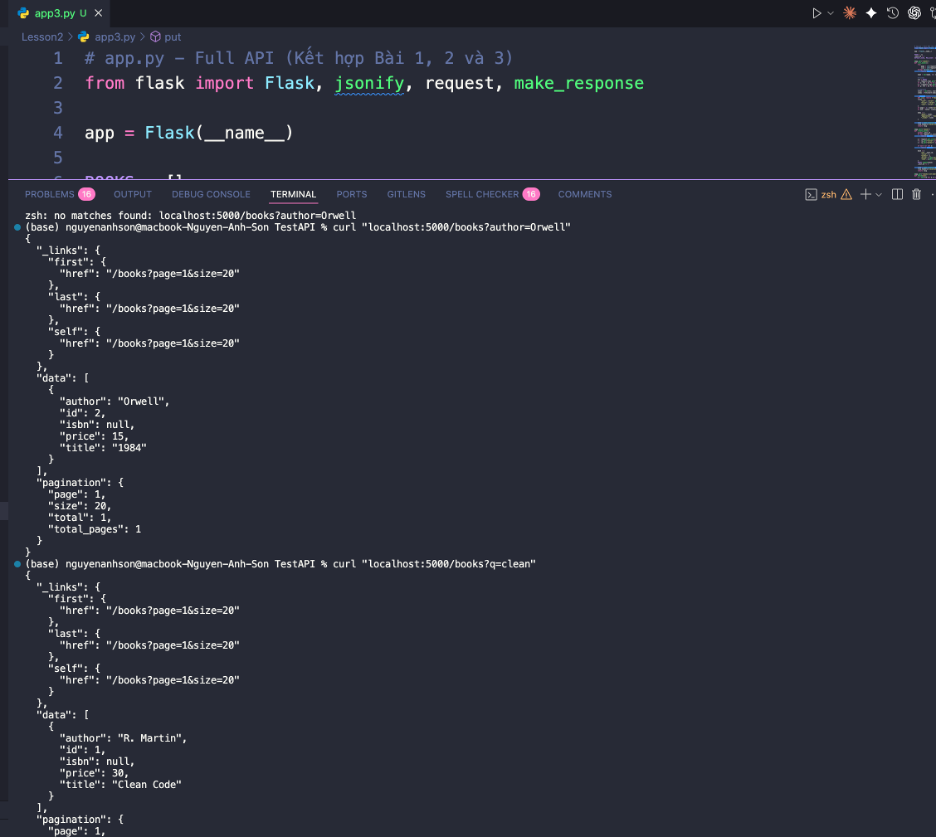
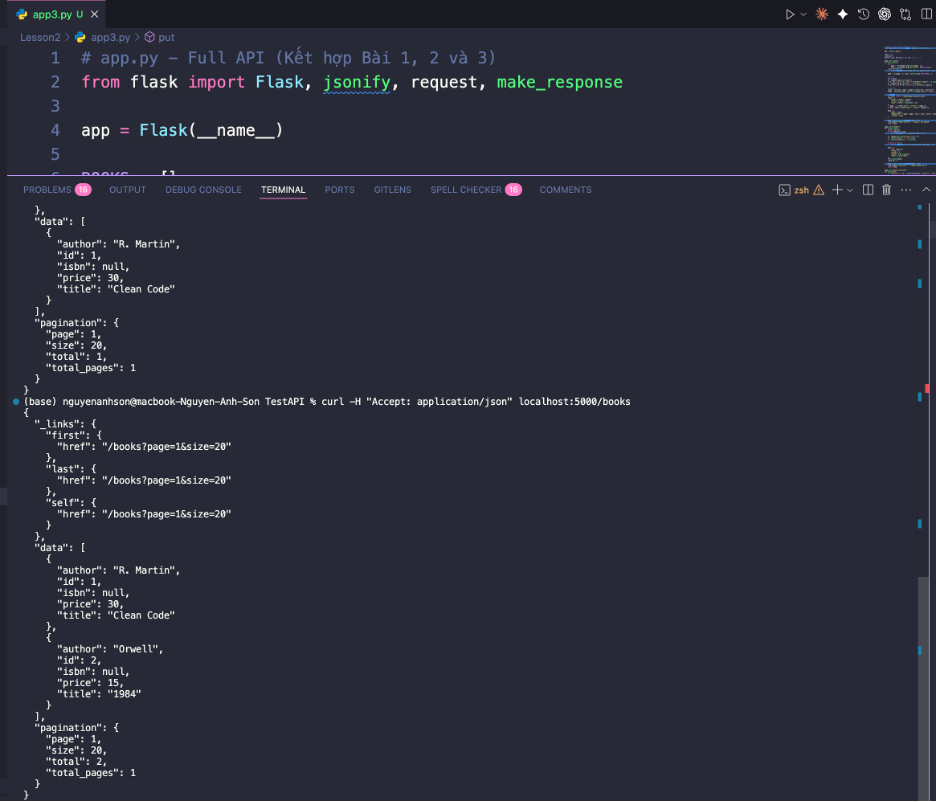

# Images

## Bài 1

  
   
  <em>Kiểm thử <code>GET /books</code> để lấy danh sách sách, <code>POST /books</code> để tạo sách mới và trường hợp thiếu dữ liệu trả về mã 422.</em>

  
   
  <em>Kiểm tra các phản hồi của <code>POST /books</code>: tạo thành công với mã 201, thiếu trường bắt buộc với mã 422 và thiếu Content-Type JSON với mã 415.</em>

## Bài 2

  
   
  <em>Tạo dữ liệu sách để kiểm thử và gửi <code>DELETE /books/1</code>, nhận mã 204 No Content khi xóa thành công.</em>

## Bài 3

  
   
  <em>Tạo dữ liệu mẫu và gọi <code>GET /books</code> để kiểm tra kết quả phân trang cùng các liên kết HATEOAS.</em>

  
   
  <em>Gọi <code>GET /books?author=Orwell</code> để lọc danh sách sách theo tên tác giả.</em>

  
   
  <em>Yêu cầu phản hồi JSON và kiểm tra cấu trúc kết quả gồm dữ liệu sách, thông tin phân trang và các liên kết HATEOAS.</em>

